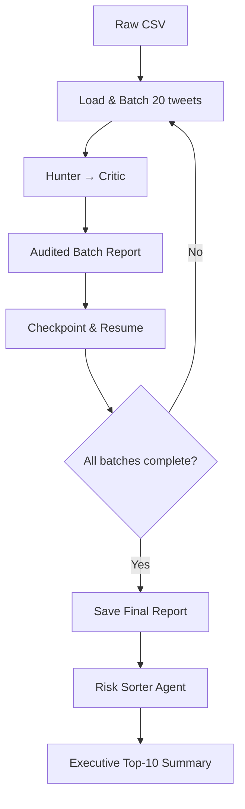

# Autonomous Agentic Risk Intelligence: Twitter Analysis

Transition from manual monitoring to autonomous risk discovery using multi-agent AI on unstructured Twitter data.

## Strategic Mission
How can autonomous agents reduce manual overhead in social media monitoring while maintaining high precision in risk detection?

## Agent Architecture
- Hunter: High-recall anomaly detection across tweet batches
- Critic: Precision audit with severity scoring (1-10)
- Sorter: Dynamic prioritization across the full report

## Tech Stack
- CrewAI multi-agent orchestration
- Groq Llama-3.3-70B (free tier + <€2 paid for rate limits)
- Python 3.12 + Pandas
- 5,000-tweet Kaggle sample processed in 250 batches of 20

## Key Outcomes
- Full audited report: outputs/risk_report_5000sample_final.csv
- Top 10 prioritized risks: [EXECUTIVE_SUMMARY.md](EXECUTIVE_SUMMARY.md)
- Sample batch outputs: [SAMPLE_INSIGHTS.md](SAMPLE_INSIGHTS.md)

---
## Process Flow

---
## Skills Demonstrated
| Skill | Impact |
| :--- | :--- |
| **Agentic AI Orchestration** | Designing multi-agent workflows for complex analytical tasks. |
| **AI Governance** | Implementing self-correction loops to ensure data integrity. |
| **Cognitive Data Processing** | Transforming unstructured noise into structured, prioritized metrics. |
| **Scalable Risk Modeling** | Developing AI-driven frameworks for business-critical oversight. |