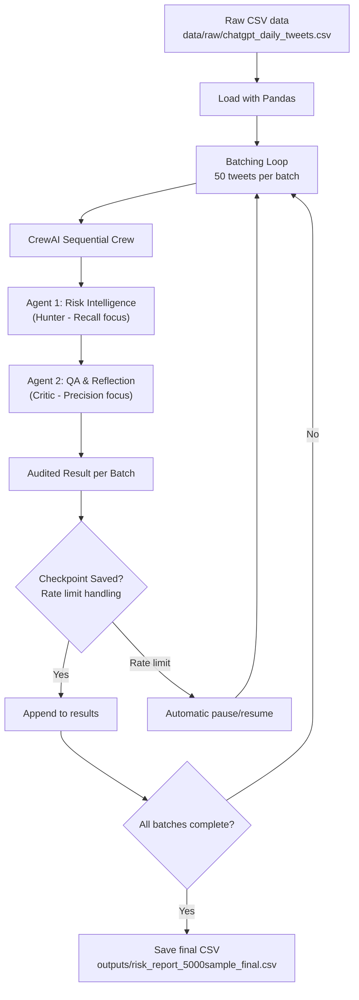

# 🤖 Autonomous Agentic Risk Intelligence: Twitter Analysis

## 🚀 The Agentic Evolution
This project demonstrates the transition from manual data monitoring to **Autonomous Risk Discovery**. By leveraging a multi-agent AI architecture, the system automates the identification and prioritization of market threats within complex social media datasets.

---
## 🎯 Strategic Mission
The system focuses on scaling intelligence:
> **"How can autonomous agents reduce the manual overhead of social media monitoring while maintaining high precision in risk detection?"**

---
## 🧠 Agent Architecture: The "Hunter-Critic" Governance
The core of this project is a self-reflecting multi-agent system designed to replace static filtering with dynamic reasoning.

### 1. The Risk Intelligence Agent (The "Hunter")
- **Autonomous Role:** Analyzes unstructured tweet datasets for emerging anomalies.
- **Cognitive Task:** Identifies sentiment shifts, geopolitical triggers, and brand risks.
- **Optimization:** Focused on **Recall** to capture all potential high-impact signals.

### 2. The QA & Reflection Agent (The "Critic")
- **Autonomous Role:** Audits findings through Agentic Reflection.
- **Cognitive Task:** Cross-validates findings, reduces potential hallucinations, and assigns a **Severity Score (1-10)**.
- **Optimization:** Focused on **Precision** to ensure results are actionable for decision-makers.

---
## 🛠️ The Agentic Stack
- **Orchestration:** CrewAI multi-agent framework (sequential process)
- **Intelligence:** Groq-hosted Llama-3.3-70B-Versatile (high-speed cloud inference, free tier sufficient)
- **Dataset:** ChatGPT-related daily tweets (Kaggle public dataset, 5000-tweet sample fully analyzed)
- **Processing:** Batched execution (50 tweets per batch) with checkpointing and automatic rate-limit/daily-limit handling
- **Language:** Python 3.12
- **Data Handling:** Pandas

---
## ⚙️ Intelligent Data Engineering
- **Feature Engineering:** Isolation of tweet text and creation timestamps for analysis focus.
- **Temporal Consistency:** Leverages pre-normalized UTC timestamps from raw data.
- **Resilient Execution:** Checkpointing after every batch, automatic pauses for rate limits and daily token caps, safe resume capability.

🔸 Note: Entire 5000-tweet analysis completed on Groq (minimal paid usage: <2 euros to bypass free-tier rate limits). Final report saved as `outputs/risk_report_5000sample_final.csv`.

---
## 🛠️ Skills Demonstrated
| Skill | Impact |
| :--- | :--- |
| **Agentic AI Orchestration** | Designing multi-agent workflows for complex analytical tasks. |
| **AI Governance** | Implementing self-correction loops to ensure data integrity. |
| **Cognitive Data Processing** | Transforming unstructured noise into structured, prioritized metrics. |
| **Scalable Risk Modeling** | Developing AI-driven frameworks for business-critical oversight. |

---
## 📊 Process Flow

---
## 🎉 Project Status (December 2025)
- **Status:** Complete & Functional  
- **Dataset Processed:** 5,000 ChatGPT-related tweets (random sample)  
- **Batches Analyzed:** 250 (20 tweets each)  
- **Output:** Full audited risk report with Hunter-Critic governance  
- **Cost:** Minimal (<€2 via Groq paid tier to bypass free-tier daily limits)  
- **Key Features Proven:** Checkpointing, rate-limit resilience, sequential CrewAI orchestration  

Final report: `outputs/risk_report_5000sample_final.csv`

---
## 🔍 Insights & Methodology
**How do autonomous agents reduce manual overhead while maintaining precision?**

- **Massive Noise Filtering:** The system autonomously filtered 5,000 raw tweets into 250 high-priority risk insights, reducing human review volume by ~95%.
- **Dual-Agent Governance:** Precision is ensured by the Hunter-Critic loop — every risk identified by the analyst must pass a compliance audit before finalization.
- **Operational Resilience:** The architecture handles API rate limits and long-running processes through systematic checkpointing, ensuring no data loss or redundant computation.

---
## 📢 Data Quality Note
Raw Kaggle Twitter datasets contain real-world noise including bot spam and repetitive posts (e.g., promotional AI-tool ads with word variations like "swapped"/"snapped"/"APPED"). The Hunter-Critic crew correctly processes these low-signal batches while extracting meaningful risks from higher-quality tweets.

---
## ⚡ Sample Risk Insights
Real audited outputs from the Hunter-Critic crew (selected batches):

1. **Batch 2240-2259 – Passed**

- AUDIT VERDICT: Pass
- CRITICAL FLAWS: None identified, the report provides a comprehensive analysis of the technical risks associated with the use of ChatGPT, including potential over-reliance, data privacy concerns, and lack of transparency in AI decision-making processes. However, it would be beneficial to include more specific examples and quantitative data to support the severity score and strategic impact.
- FINAL STRENGTHENED ASSESSMENT: The analyst report provides a thorough examination of the technical risks associated with ChatGPT, highlighting the potential consequences of over-reliance, data privacy concerns, and lack of transparency in AI decision-making processes. With a severity score of 7, the report emphasizes the need for guidelines and regulations to ensure the responsible use of ChatGPT and other AI systems. The strategic impact of these risks is significant, with potential damage to credibility, contribution to the spread of misinformation, and erosion of trust in AI systems. To mitigate these risks, investing in education and research that promotes critical thinking, media literacy, and AI transparency is crucial. Overall, the report demonstrates a clear understanding of the technical risks and strategic implications associated with ChatGPT, providing a solid foundation for developing effective risk management strategies.

2. **Batch 3940-3959 – Passed**

- AUDIT VERDICT: Pass
- CRITICAL FLAWS: None identified, the report provides a comprehensive analysis of the technical risk associated with the potential misuse of ChatGPT, including evidence from tweets and a discussion of the strategic implications. However, it would be beneficial to include more specific recommendations for mitigating the identified risks and to provide a more detailed analysis of the potential consequences of the misuse of ChatGPT.
FINAL STRENGTHENED ASSESSMENT: The analyst report provides a thorough examination of the technical risk associated with the potential misuse of ChatGPT, highlighting the potential for malicious activities, such as generating harmful content or exploiting vulnerabilities in the system. The report also discusses the strategic implications of this risk, including the potential damage to the reputation of the system and the loss of trust among users. To strengthen the report, it would be beneficial to include more specific recommendations for mitigating the identified risks, such as implementing robust security measures and providing clear guidelines for users. Additionally, a more detailed analysis of the potential consequences of the misuse of ChatGPT, including the potential impact on the developers and users of the system, would provide a more comprehensive understanding of the risk. Overall, the report provides a solid foundation for understanding the technical risk associated with ChatGPT and highlights the need for ongoing monitoring and evaluation of the use of the system.     

3. **Batch 60-79 – Requires Revision**

- AUDIT VERDICT: Requires Revision
- CRITICAL FLAWS: The analyst report provides a comprehensive overview of the technical risks associated with ChatGPT, including potential misuse, data privacy and security risks, dependence on AI, misinformation and disinformation, and vulnerabilities in the AI system. However, the report lacks specific examples and evidence to support some of the claims, and the severity score of 7 seems subjective and not fully justified. Additionally, the report could benefit from more detailed and actionable recommendations for mitigating the identified technical risks.
- FINAL STRENGTHENED ASSESSMENT: The analyst report highlights significant technical risks associated with ChatGPT, including potential misuse, data privacy and security risks, and the spread of misinformation and disinformation. To strengthen the assessment, it is essential to provide more specific examples and evidence to support the claims, and to develop more detailed and actionable recommendations for mitigating the identified risks. This could include implementing robust data privacy and security measures, developing strategies to address job displacement, and deploying fact-checking and content moderation tools. By revising the report to address these critical flaws, a more comprehensive and effective risk assessment can be developed to ensure the safe and responsible use of ChatGPT.