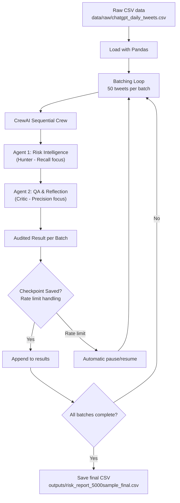

# 🤖 Autonomous Agentic Risk Intelligence: Twitter Analysis

## 🚀 The Agentic Evolution
This project demonstrates the transition from manual data monitoring to **Autonomous Risk Discovery**. By leveraging a multi-agent AI architecture, the system automates the identification and prioritization of market threats within complex social media datasets.

---
## 🎯 Strategic Mission
The system focuses on scaling intelligence:
> **"How can autonomous agents reduce the manual overhead of social media monitoring while maintaining high precision in risk detection?"**

---
## 🧠 Agent Architecture: The "Hunter-Critic" Governance
The core of this project is a self-reflecting multi-agent system designed to replace static filtering with dynamic reasoning.

### 1. The Risk Intelligence Agent (The "Hunter")
- **Autonomous Role:** Analyzes unstructured tweet datasets for emerging anomalies.
- **Cognitive Task:** Identifies sentiment shifts, geopolitical triggers, and brand risks.
- **Optimization:** Focused on **Recall** to capture all potential high-impact signals.

### 2. The QA & Reflection Agent (The "Critic")
- **Autonomous Role:** Audits findings through Agentic Reflection.
- **Cognitive Task:** Cross-validates findings, reduces potential hallucinations, and assigns a **Severity Score (1-10)**.
- **Optimization:** Focused on **Precision** to ensure results are actionable for decision-makers.

---
## 🛠️ The Agentic Stack
- **Orchestration:** CrewAI multi-agent framework (sequential process)
- **Intelligence:** Groq-hosted Llama-3.3-70B-Versatile (high-speed cloud inference, free tier sufficient)
- **Dataset:** ChatGPT-related daily tweets (Kaggle public dataset, 5000-tweet sample fully analyzed)
- **Processing:** Batched execution (50 tweets per batch) with checkpointing and automatic rate-limit/daily-limit handling
- **Language:** Python 3.12
- **Data Handling:** Pandas

---
## ⚙️ Intelligent Data Engineering
- **Feature Engineering:** Isolation of tweet text and creation timestamps for analysis focus.
- **Temporal Consistency:** Leverages pre-normalized UTC timestamps from raw data.
- **Resilient Execution:** Checkpointing after every batch, automatic pauses for rate limits and daily token caps, safe resume capability.

🔸 Note: Entire 5000-tweet analysis completed on Groq free tier (no cost incurred). Final report saved as `outputs/risk_report_5000sample_final.csv`.

---
## 🛠️ Skills Demonstrated
| Skill | Impact |
| :--- | :--- |
| **Agentic AI Orchestration** | Designing multi-agent workflows for complex analytical tasks. |
| **AI Governance** | Implementing self-correction loops to ensure data integrity. |
| **Cognitive Data Processing** | Transforming unstructured noise into structured, prioritized metrics. |
| **Scalable Risk Modeling** | Developing AI-driven frameworks for business-critical oversight. |

---
## 📊 Process Flow

